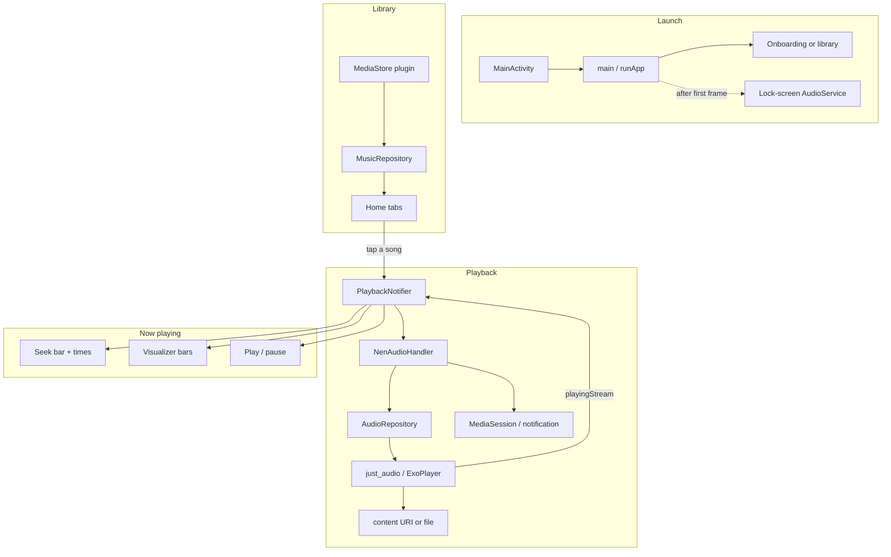

# nen

Offline music player for the files already on your phone. Local playback only — no streaming, no ads, no account.

**Play:** [dev.csy20.nen](https://play.google.com/store/apps/details?id=dev.csy20.nen) (early access)

Current version: **1.0.13+15**

## Features

- Browse on-device audio by songs, albums, artists, playlists, and folders
- Background playback and lock-screen controls
- Shuffle, repeat, sleep timer, favorites
- Dark / light theme
- Dart-only now-playing meter (no microphone, no Android Visualizer JNI)

Supported formats go through the system decoder (ExoPlayer): MP3, FLAC, WAV, OGG, AAC, M4A, and other common types MediaStore can see.

## How it works



Playback state (play/pause icon, meter) follows ExoPlayer’s `playing` flag, not the lock-screen session.

## Stack

| Layer | Tech |
|---|---|
| UI | Flutter, Riverpod |
| Library | Android MediaStore (`LibraryMediaStorePlugin`) |
| Audio | `just_audio` / ExoPlayer |
| Background | `audio_service` |
| Playlists | SQLite |
| Settings | SharedPreferences |

## Build a Play AAB

```bash
bash build_release_aab.sh
```

That produces an obfuscated release bundle:

- `build/app/outputs/bundle/release/app-release.aab`
- Dart symbols: `build/app/outputs/symbols/`

Signing uses `android/key.properties` (not in git).

## Layout

```
lib/
  main.dart
  domain/          entities, repository contracts
  data/            MediaStore, ExoPlayer, audio handler
  presentation/    screens, widgets, Riverpod providers
android/app/src/main/kotlin/dev/csy20/nen/
  MainActivity.kt
  LibraryMediaStorePlugin.kt
```

## License

Private / unpublished (`publish_to: none`).
